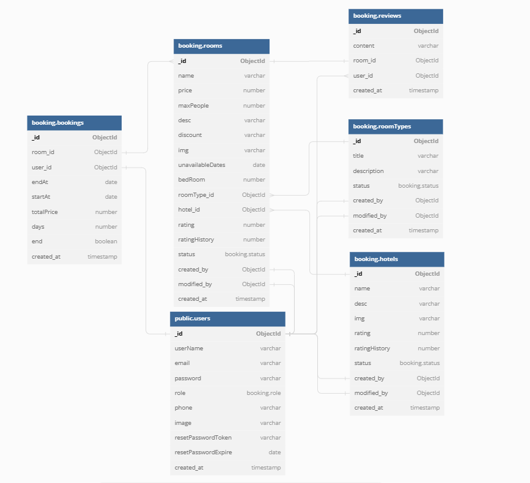

# Project Demo

Coming Soon

## Getting Started

These instructions will get you a copy of the project up and running on your local machine for development and testing purposes.

### Prerequisites

NPM / Yarn and Node.js installed

### Api Documentation

Extensive and testing documentation with postman: [Booking Api](https://documenter.getpostman.com/view/17918238/2s8YzQW3vM)

### Database Model

Though the diagram uses sql data type, this diagram is to show you the various collections in the mongo database.
[Booking Diagram](https://documenter.getpostman.com/view/17918238/2s8YzQW3vM)


### Configuration File

Modify to your environment variables, mongodb url, set your JWT_SECRET and SMTP variables

### Installing

Installing NPM modules on both client and server folders

Execute these commands from the project directory

```console
npm install
```

### Running the app

Open a terminal on api directory

```console
npm run dev
```
